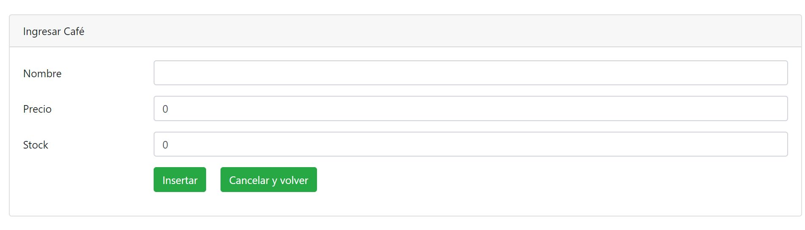

# Abril3
Proyecto clase de Java Spring Mantenedor 2.0 



## Como usar el proyecto:

* Ejecutar el comando en una ventana cmd o shell console donde esten ejecutando el proyecto

> git clone https://github.com/jorgecc/Abril3.git

* Si no tiene git instalado, lo puede instalar desde

https://git-scm.com/

Con todos los datos por defecto, y volver a abir la ventana cmd (o shell console)

* Esto va a crear una carpeta llamada /Abril3.

* Abrir en Netbeans esa carpeta

* En other sources / src main / resources modificar el archivo application.properties

* Ejecutar la aplicacion y probar

Que direccion? Revise el controlador.  

La ruta es http://localhost:8080/coffee/listar

* Puede agregar datos de ejemplo ejecutando esto en Mysql Workbench

(Pero para que funcione, tiene que estar la tabla creada).

```sql

INSERT INTO `coffee` (`id_coffee`, `name`, `price`, `stock`) VALUES ('1', 'Brew Rite Cleaner for Automatic Drip Coffee and Espresso Machines', '22475', '337');

INSERT INTO `coffee` (`id_coffee`, `name`, `price`, `stock`) VALUES ('2', 'At the Sign of the Crumhorn [Early Music]', '220250', '1');

INSERT INTO `coffee` (`id_coffee`, `name`, `price`, `stock`) VALUES ('3', 'Bunn Speed Brew Classic Black Coffee Maker', '22450', '161');

INSERT INTO `coffee` (`id_coffee`, `name`, `price`, `stock`) VALUES ('4', 'Gevalia Signature Blend Ground Coffee T-Disc For Tassimo Brewing System, 16 Count', '18125', '4');

INSERT INTO `coffee` (`id_coffee`, `name`, `price`, `stock`) VALUES ('5', 'Melitta #2 White Cone Coffee Filters, 100 Ct', '22200', '4');

INSERT INTO `coffee` (`id_coffee`, `name`, `price`, `stock`) VALUES ('6', 'Melitta Natural Brown Paper Cone Coffee Filters #4 Size 100 ct Box', '21225', '382');

INSERT INTO `coffee` (`id_coffee`, `name`, `price`, `stock`) VALUES ('7', 'Community® Coffee Between Roast Ground Coffee 16 oz. Bag', '21225', '382');

INSERT INTO `coffee` (`id_coffee`, `name`, `price`, `stock`) VALUES ('8', 'Community® Coffee Medium Roast Ground Coffee 16 oz. Bag', '11800', '266');

INSERT INTO `coffee` (`id_coffee`, `name`, `price`, `stock`) VALUES ('9', 'COFFEE MATE The Original Powder Coffee Creamer 35.3 Oz. Canister | Non-dairy, Lactose Free, Gluten Free Creamer', '10300', '177');

INSERT INTO `coffee` (`id_coffee`, `name`, `price`, `stock`) VALUES ('10', 'Maxwell House Original Roast Ground Coffee Filter Packs, Caffeinated, 5.3 oz Box', '35300', '774');

INSERT INTO `coffee` (`id_coffee`, `name`, `price`, `stock`) VALUES ('11', '(3 Pack) New England Coffee, Breakfast Blend, 12 Oz.', '12350', '774');

INSERT INTO `coffee` (`id_coffee`, `name`, `price`, `stock`) VALUES ('12', 'New England Coffee 100% Arabica Coffee Eye Opener Blend, 9 Oz.', '12350', '774');

INSERT INTO `coffee` (`id_coffee`, `name`, `price`, `stock`) VALUES ('13', 'New England Coffee French Vanilla, 11 Oz.', '16050', '160');

INSERT INTO `coffee` (`id_coffee`, `name`, `price`, `stock`) VALUES ('14', 'Starbucks Italian Roast Dark Roast Ground Coffee, 12-Ounce Bag', '15675', '160');

INSERT INTO `coffee` (`id_coffee`, `name`, `price`, `stock`) VALUES ('15', 'Starbucks Caffe Verona Dark Roast Ground Coffee, 12-Ounce Bag', '15675', '160');

INSERT INTO `coffee` (`id_coffee`, `name`, `price`, `stock`) VALUES ('16', 'Starbucks Sumatra Dark Roast Ground Coffee, 12-Ounce Bag', '37450', '392');

INSERT INTO `coffee` (`id_coffee`, `name`, `price`, `stock`) VALUES ('17', 'Eight O\'Clock The Original Whole Bean Coffee 36 Oz. Bag', '11725', '878');

INSERT INTO `coffee` (`id_coffee`, `name`, `price`, `stock`) VALUES ('18', 'Seattle\'s Best Coffee Toasted Hazelnut Flavored Medium Roast Ground Coffee, 12-Ounce Bag', '14950', '396');

INSERT INTO `coffee` (`id_coffee`, `name`, `price`, `stock`) VALUES ('19', 'Seattle\'s Best Coffee Portside Blend (Previously Signature Blend No. 3) Medium Roast Ground Coffee, 12-Ounce Bag', '13450', '396');

INSERT INTO `coffee` (`id_coffee`, `name`, `price`, `stock`) VALUES ('20', 'Seattle\'s Best Coffee 6th Avenue Bistro (Previously Signature Blend No. 4) Dark Roast Ground Coffee, 12-Ounce Bag', '0', '234');

INSERT INTO `coffee` (`id_coffee`, `name`, `price`, `stock`) VALUES ('21', 'International Delight, Amaretto Coffee Creamer, 32 Oz.', '0', '234');

INSERT INTO `coffee` (`id_coffee`, `name`, `price`, `stock`) VALUES ('22', 'International Delight Southern Butter Pecan Coffee Creamer, 1 Quart', '10950', '623');

INSERT INTO `coffee` (`id_coffee`, `name`, `price`, `stock`) VALUES ('23', 'CDM Medium Roast Coffee and Chicory Bag, 13 Oz.', '14950', '623');

INSERT INTO `coffee` (`id_coffee`, `name`, `price`, `stock`) VALUES ('24', 'CDM Coffee & Chicory, Automatic Drip 13 Oz.', '14450', '623');

INSERT INTO `coffee` (`id_coffee`, `name`, `price`, `stock`) VALUES ('25', 'CDM Coffee & Chicory Decaffeinated, 13 Oz.', '18325', '9');

INSERT INTO `coffee` (`id_coffee`, `name`, `price`, `stock`) VALUES ('26', 'Great Value Coffee Creamer, Original, 35.3 oz (2 Pack)', '7325', '9');

INSERT INTO `coffee` (`id_coffee`, `name`, `price`, `stock`) VALUES ('27', 'Great Value Classic Roast Medium Instant Coffee, 8 oz', '0', '9');

INSERT INTO `coffee` (`id_coffee`, `name`, `price`, `stock`) VALUES ('28', 'Great Value French Vanilla Coffee Creamer, 32 fl oz', '15350', '62');

INSERT INTO `coffee` (`id_coffee`, `name`, `price`, `stock`) VALUES ('29', 'Folgers Decaffeinated Instant Coffee Crystals Classic Decaf, 8-Ounce Jar', '9300', '62');

INSERT INTO `coffee` (`id_coffee`, `name`, `price`, `stock`) VALUES ('30', 'Folgers French Vanilla Artificially Flavored Ground Coffee, 11.5-Ounce', '22450', '62');

INSERT INTO `coffee` (`id_coffee`, `name`, `price`, `stock`) VALUES ('31', 'Folgers Coffee Singles Classic Roast Coffee Bags, 38 Count', '0', '234');

INSERT INTO `coffee` (`id_coffee`, `name`, `price`, `stock`) VALUES ('32', 'International Delight, Irish Creme Coffee Creamer, 1 Quart', '29650', '818');

INSERT INTO `coffee` (`id_coffee`, `name`, `price`, `stock`) VALUES ('33', 'Stephen\'s Apple Cinnamon Cider, 16 oz', '0', '160');

INSERT INTO `coffee` (`id_coffee`, `name`, `price`, `stock`) VALUES ('34', 'Starbucks Frappuccino Dark Chocolate Mocha Coffee Drink, 9.5 oz, 4pk', '0', '236');

INSERT INTO `coffee` (`id_coffee`, `name`, `price`, `stock`) VALUES ('35', 'Bolthouse Farms Mocha Cappuccino, 15.2 oz.', '0', '236');

INSERT INTO `coffee` (`id_coffee`, `name`, `price`, `stock`) VALUES ('36', 'Bolthouse Farms Mocha Cappuccino, 32 oz.', '14575', '163');

INSERT INTO `coffee` (`id_coffee`, `name`, `price`, `stock`) VALUES ('37', 'Dunkin\' Donuts Original Blend Ground Coffee, Medium Roast, 12-Ounce', '15675', '160');

INSERT INTO `coffee` (`id_coffee`, `name`, `price`, `stock`) VALUES ('38', 'Starbucks Espresso Roast Dark Roast Ground Coffee, 12-Ounce Bag', '31175', '160');

INSERT INTO `coffee` (`id_coffee`, `name`, `price`, `stock`) VALUES ('39', 'Starbucks House Blend Medium Roast Coffee, Whole Bean, 12-Ounce Bag', '15675', '160');

INSERT INTO `coffee` (`id_coffee`, `name`, `price`, `stock`) VALUES ('40', 'Starbucks House Blend Medium Roast Ground Coffee, 12-Ounce Bag', '15675', '160');

INSERT INTO `coffee` (`id_coffee`, `name`, `price`, `stock`) VALUES ('41', 'Starbucks Decaf House Blend Medium Roast Ground Coffee, 12-Ounce Bag', '15675', '160');

INSERT INTO `coffee` (`id_coffee`, `name`, `price`, `stock`) VALUES ('42', 'Starbucks Colombia Medium Roast Ground Coffee, 12-Ounce Bag', '36225', '160');

INSERT INTO `coffee` (`id_coffee`, `name`, `price`, `stock`) VALUES ('43', 'Starbucks French Roast Dark Roast Coffee, Whole Bean, 12-Ounce Bag', '15675', '160');

INSERT INTO `coffee` (`id_coffee`, `name`, `price`, `stock`) VALUES ('44', 'Starbucks French Roast Dark Roast Ground Coffee, 12-Ounce Bag', '34975', '160');

INSERT INTO `coffee` (`id_coffee`, `name`, `price`, `stock`) VALUES ('45', 'Starbucks Breakfast Blend Medium Roast Whole Bean Coffee, 12-Ounce Bag', '15675', '160');

INSERT INTO `coffee` (`id_coffee`, `name`, `price`, `stock`) VALUES ('46', 'Starbucks Breakfast Blend Medium Roast Ground Coffee, 12-Ounce Bag', '0', '386');

INSERT INTO `coffee` (`id_coffee`, `name`, `price`, `stock`) VALUES ('47', 'Cain\'s: Coffee Creme Creamer Original Beverage, 16 Oz', '0', '386');

INSERT INTO `coffee` (`id_coffee`, `name`, `price`, `stock`) VALUES ('48', 'Cain?s Coffee Creme Fat Free Creamer, 16 oz', '0', '9');

INSERT INTO `coffee` (`id_coffee`, `name`, `price`, `stock`) VALUES ('49', 'Great Value Half & Half, 16 fl oz', '15800', '382');

INSERT INTO `coffee` (`id_coffee`, `name`, `price`, `stock`) VALUES ('50', 'Community Coffee Dark Roast Signature Blend Instant Coffee 7 oz. Jar', '15800', '382');

INSERT INTO `coffee` (`id_coffee`, `name`, `price`, `stock`) VALUES ('51', 'Community Coffee® Breakfast Blend Medium Roast Instant Coffee 7 oz. Jar', '16725', '382');

INSERT INTO `coffee` (`id_coffee`, `name`, `price`, `stock`) VALUES ('52', 'Community Coffee® Cafe Special Medium-Dark Roast Decaffeinated Instant Coffee 7 oz. Jar', '15475', '382');

INSERT INTO `coffee` (`id_coffee`, `name`, `price`, `stock`) VALUES ('53', 'Community Coffee Coffee & Chicory Medium-Dark Roast Instant Coffee 7 oz. Jar', '14350', '382');

INSERT INTO `coffee` (`id_coffee`, `name`, `price`, `stock`) VALUES ('54', 'Community® Coffee Breakfast Blend Medium Roast Whole Bean Coffee 12 oz. Bag', '21225', '382');

INSERT INTO `coffee` (`id_coffee`, `name`, `price`, `stock`) VALUES ('55', 'Community® Coffee Coffee & Chicory Ground Coffee 16 oz. Bag', '27475', '382');

INSERT INTO `coffee` (`id_coffee`, `name`, `price`, `stock`) VALUES ('56', 'Community Coffee Between Roast Ground Coffee 23 oz. Bag', '37475', '382');

INSERT INTO `coffee` (`id_coffee`, `name`, `price`, `stock`) VALUES ('57', 'Community® Coffee Decaffeinated Ground Coffee 23 oz. Bag', '22475', '473');

INSERT INTO `coffee` (`id_coffee`, `name`, `price`, `stock`) VALUES ('58', 'Cafe La Llave: 100% Pure Coffee Espresso, 10 oz', '10850', '411');

INSERT INTO `coffee` (`id_coffee`, `name`, `price`, `stock`) VALUES ('59', 'Don Francisco\'s Hawaiian Hazelnut Flavored Ground Coffee, 12 oz', '10850', '411');

INSERT INTO `coffee` (`id_coffee`, `name`, `price`, `stock`) VALUES ('60', 'Don Francisco\'s Vanilla Nut Medium Gourmet Coffee, 12 oz', '0', '260');

INSERT INTO `coffee` (`id_coffee`, `name`, `price`, `stock`) VALUES ('61', 'Monster Java Loca Moca Coffee + Energy Drink, 15 Fl. Oz., 4 Count', '0', '260');

INSERT INTO `coffee` (`id_coffee`, `name`, `price`, `stock`) VALUES ('62', 'Monster Java Mean Bean Energy Drink, 15 Fl. Oz., 4 Count', '13825', '4');

INSERT INTO `coffee` (`id_coffee`, `name`, `price`, `stock`) VALUES ('63', 'Melitta #4 Natural Brown Cone Coffee Filters, 40 Ct', '11900', '382');

INSERT INTO `coffee` (`id_coffee`, `name`, `price`, `stock`) VALUES ('64', 'Community® Coffee Café Special® Medium-Dark Roast Ground Coffee 12 oz. Bag', '14975', '382');

INSERT INTO `coffee` (`id_coffee`, `name`, `price`, `stock`) VALUES ('65', 'Community® Coffee Signature Blend Dark Roast Whole Bean Coffee 12 oz. Bag', '8800', '193');

INSERT INTO `coffee` (`id_coffee`, `name`, `price`, `stock`) VALUES ('66', 'Caf Bustelo Espresso Ground Coffee, Dark Roast, 10-Ounce Can', '31450', '193');

INSERT INTO `coffee` (`id_coffee`, `name`, `price`, `stock`) VALUES ('67', 'Caf Bustelo Espresso Ground Coffee, Dark Roast, 36-Ounce Canister', '23175', '193');

INSERT INTO `coffee` (`id_coffee`, `name`, `price`, `stock`) VALUES ('68', 'JM Smucker Cafe Bustelo  Coffee, 10 oz', '27425', '193');

INSERT INTO `coffee` (`id_coffee`, `name`, `price`, `stock`) VALUES ('69', 'Café Bustelo Instant Coffee', '22475', '193');

INSERT INTO `coffee` (`id_coffee`, `name`, `price`, `stock`) VALUES ('70', 'Cafe Bustelo Espresso Instant Decaffeinated Coffee, 1.75 oz', '42475', '193');

INSERT INTO `coffee` (`id_coffee`, `name`, `price`, `stock`) VALUES ('71', 'Cafe Bustelo Instant Coffee, 7.05-Ounce', '27475', '193');

INSERT INTO `coffee` (`id_coffee`, `name`, `price`, `stock`) VALUES ('72', 'Supreme by Bustelo Espresso Ground Coffee, 10-Ounce Brick', '19125', '493');

INSERT INTO `coffee` (`id_coffee`, `name`, `price`, `stock`) VALUES ('73', 'Pilon Ground Espresso Coffee, 6-Ounce Brick', '17450', '493');

INSERT INTO `coffee` (`id_coffee`, `name`, `price`, `stock`) VALUES ('74', 'Café Pilon Instant Espresso Coffee, 7.05-Ounce Jar', '19975', '493');

INSERT INTO `coffee` (`id_coffee`, `name`, `price`, `stock`) VALUES ('75', 'JM Smucker Pilon Coffee, 1.75 oz', '13450', '743');

INSERT INTO `coffee` (`id_coffee`, `name`, `price`, `stock`) VALUES ('76', 'Pilon Espresso, 100% Arabica Coffee, 10-Ounce Brick', '13450', '743');

INSERT INTO `coffee` (`id_coffee`, `name`, `price`, `stock`) VALUES ('77', 'Caf Pilon Decaffeinated Espresso Ground Coffee, 10-Ounce', '25275', '493');

INSERT INTO `coffee` (`id_coffee`, `name`, `price`, `stock`) VALUES ('78', 'Café Pilon Espresso Coffee, 36-Ounce Can', '49825', '493');

INSERT INTO `coffee` (`id_coffee`, `name`, `price`, `stock`) VALUES ('79', 'Pilon Gourmet Whole Bean Espresso Coffee, 16 Oz', '42475', '743');

INSERT INTO `coffee` (`id_coffee`, `name`, `price`, `stock`) VALUES ('80', 'Caf Pilon Espresso Ground Coffee, 16-Ounce', '32475', '193');

INSERT INTO `coffee` (`id_coffee`, `name`, `price`, `stock`) VALUES ('81', 'Supreme by Bustelo Espresso Ground Coffee, 10-Ounce Can', '44975', '193');

INSERT INTO `coffee` (`id_coffee`, `name`, `price`, `stock`) VALUES ('82', 'Cafe Bustelo Ground Coffee, Dark Roast, 16-Ounce Brick', '0', '234');

INSERT INTO `coffee` (`id_coffee`, `name`, `price`, `stock`) VALUES ('83', 'International Delight Hershey\'s Chocolate Caramel Coffee Creamer, 1 Quart', '23825', '62');

INSERT INTO `coffee` (`id_coffee`, `name`, `price`, `stock`) VALUES ('84', 'JM Smucker Folgers  Coffee, 33.9 oz', '0', '373');

INSERT INTO `coffee` (`id_coffee`, `name`, `price`, `stock`) VALUES ('85', 'Mocha Mix Original Non-Dairy Coffee Creamer, Half Gallon', '0', '266');

INSERT INTO `coffee` (`id_coffee`, `name`, `price`, `stock`) VALUES ('86', 'COFFEE MATE Cinnamon Vanilla Creme Liquid Coffee Creamer 32 Fl. Oz. Bottle | Non-dairy, Lactose Free, Gluten Free Creamer', '24425', '4');

INSERT INTO `coffee` (`id_coffee`, `name`, `price`, `stock`) VALUES ('87', 'Melitta® Classic Decaf Medium Roast Ground Coffee 10.5 oz. Canister', '34125', '163');

INSERT INTO `coffee` (`id_coffee`, `name`, `price`, `stock`) VALUES ('88', 'Dunkin\' Donuts Dunkin\' Dark Ground Coffee, 11 oz.', '0', '234');

INSERT INTO `coffee` (`id_coffee`, `name`, `price`, `stock`) VALUES ('89', 'International Delight French Vanilla Gourmet Coffee Creamer, 1 Pint', '5350', '235');

INSERT INTO `coffee` (`id_coffee`, `name`, `price`, `stock`) VALUES ('90', 'Monster Java Kona Blend Energy Drink, 15 Fl. Oz.', '0', '616');

INSERT INTO `coffee` (`id_coffee`, `name`, `price`, `stock`) VALUES ('91', 'Colcafe S.A.: Coffee Decafe Instant, 1.76 oz', '0', '266');

INSERT INTO `coffee` (`id_coffee`, `name`, `price`, `stock`) VALUES ('92', 'COFFEE MATE Pumpkin Spice Liquid Coffee Creamer 16 Fl. Oz. Bottle | Non-dairy, Lactose Free, Gluten Free Creamer', '9300', '62');

INSERT INTO `coffee` (`id_coffee`, `name`, `price`, `stock`) VALUES ('93', 'Folgers Hazelnut Artificially Flavored Ground Coffee, 11.5-Ounce', '0', '9');

INSERT INTO `coffee` (`id_coffee`, `name`, `price`, `stock`) VALUES ('94', 'Great Value Vanilla Caramel Coffee Creamer, 32 fl oz', '0', '9');

INSERT INTO `coffee` (`id_coffee`, `name`, `price`, `stock`) VALUES ('95', 'Great Value Hazelnut Coffee Creamer, 32 fl oz', '22950', '160');

INSERT INTO `coffee` (`id_coffee`, `name`, `price`, `stock`) VALUES ('96', 'Starbucks Espresso Roast Dark Roast Whole Bean Coffee, 12-Ounce Bag', '16050', '160');

INSERT INTO `coffee` (`id_coffee`, `name`, `price`, `stock`) VALUES ('97', 'Starbucks Morning Joe Gold Coast Dark Roast Ground Coffee, 12-Ounce Bag', '23725', '160');

INSERT INTO `coffee` (`id_coffee`, `name`, `price`, `stock`) VALUES ('98', 'Starbucks Caffe Verona Dark Roast Whole Bean Coffee, 12-Ounce Bag', '19975', '160');

INSERT INTO `coffee` (`id_coffee`, `name`, `price`, `stock`) VALUES ('99', 'Starbucks Decaf Ground Coffee, Verona, 12 Oz', '0', '234');

INSERT INTO `coffee` (`id_coffee`, `name`, `price`, `stock`) VALUES ('100', 'International Delight White Chocolate Raspberry Coffee Creamer, 1 Quart', '14475', '396');

INSERT INTO `coffee` (`id_coffee`, `name`, `price`, `stock`) VALUES ('101', 'Seattle\'s Best Coffee Decaf Portside Blend (Previously Signature Blend No. 3) Medium Roast Ground Coffee, 12-Ounce Bag', '13450', '396');

INSERT INTO `coffee` (`id_coffee`, `name`, `price`, `stock`) VALUES ('102', 'Seattle\'s Best Coffee Post Alley Blend (Previously Signature Blend No. 5) Dark Roast Ground Coffee, 12-Ounce Bag', '14950', '396');

INSERT INTO `coffee` (`id_coffee`, `name`, `price`, `stock`) VALUES ('103', 'Seattle\'s Best Coffee Portside Blend (Previously Signature Blend No. 3) Medium Roast Whole Bean Coffee, 12-Ounce Bag', '13450', '878');

INSERT INTO `coffee` (`id_coffee`, `name`, `price`, `stock`) VALUES ('104', 'Seattle\'s Best Coffee 6th Avenue Bistro (Previously Signature Blend No. 4) Fair Trade Organic Dark Roast Ground Coffee, 12-Ounce Bag', '80000', '152');

INSERT INTO `coffee` (`id_coffee`, `name`, `price`, `stock`) VALUES ('105', 'Hamilton Beach 45 Cup Coffee Urn | Model# 40515R', '110225', '155');

INSERT INTO `coffee` (`id_coffee`, `name`, `price`, `stock`) VALUES ('106', 'Farberware 2-4 Cup* Electric Percolator, Stainless Steel, FCP240', '37475', '154');

INSERT INTO `coffee` (`id_coffee`, `name`, `price`, `stock`) VALUES ('107', 'Mr. Coffee Simple Brew 4-Cup Switch Coffee Maker, White TF4 Series', '6250', '160');

INSERT INTO `coffee` (`id_coffee`, `name`, `price`, `stock`) VALUES ('108', 'Starbucks Frappuccino Chilled Coffee Drink 13.7 fl. oz. Bottle', '6250', '160');

INSERT INTO `coffee` (`id_coffee`, `name`, `price`, `stock`) VALUES ('109', 'Starbucks Frappuccino Chilled Coffee Drink, Mocha, 13.7 oz Glass Bottle', '6250', '160');

INSERT INTO `coffee` (`id_coffee`, `name`, `price`, `stock`) VALUES ('110', 'Starbucks Doubleshot Mocha Energy Coffee Beverage, 15 fl oz', '6250', '160');

INSERT INTO `coffee` (`id_coffee`, `name`, `price`, `stock`) VALUES ('111', 'Starbucks Doubleshot Energy Coffee Energy Coffee Beverage 15 fl. oz. Can', '6250', '160');

INSERT INTO `coffee` (`id_coffee`, `name`, `price`, `stock`) VALUES ('112', 'Starbucks Frappuccino Vanilla Chilled Coffee Drink 13.7 fl. oz. Bottle', '0', '160');

INSERT INTO `coffee` (`id_coffee`, `name`, `price`, `stock`) VALUES ('113', 'Starbucks Ready To Drink Light Italian Roast Iced Coffee, 11 Fl. Oz.', '0', '732');

INSERT INTO `coffee` (`id_coffee`, `name`, `price`, `stock`) VALUES ('114', 'Luzianne Instant Coffee & Chicory Beverage, 8 oz', '7925', '266');

INSERT INTO `coffee` (`id_coffee`, `name`, `price`, `stock`) VALUES ('115', 'COFFEE MATE The Original Powder Coffee Creamer 16 Oz. Canister | Non-dairy, Lactose Free, Gluten Free Creamer', '9950', '266');

INSERT INTO `coffee` (`id_coffee`, `name`, `price`, `stock`) VALUES ('116', 'COFFEE MATE The Original Powder Coffee Creamer 22 Oz. Canister | Non-dairy, Lactose Free, Gluten Free Creamer', '22400', '175');

INSERT INTO `coffee` (`id_coffee`, `name`, `price`, `stock`) VALUES ('117', 'Green Mountain Coffee Breakfast Blend K-Cup Pods, Light Roast, 18 Count for Keurig Brewers', '22450', '175');

INSERT INTO `coffee` (`id_coffee`, `name`, `price`, `stock`) VALUES ('118', 'Green Mountain Coffee Nantucket Blend, Keurig K-Cup Pod, Medium Roast, 18 Ct', '27900', '160');

INSERT INTO `coffee` (`id_coffee`, `name`, `price`, `stock`) VALUES ('119', 'Starbucks House Blend Medium Roast Ground Coffee, 20-Ounce Bag', '15675', '160');

INSERT INTO `coffee` (`id_coffee`, `name`, `price`, `stock`) VALUES ('120', 'Starbucks Pike Place Roast Medium Roast Ground Coffee, 12-Ounce Bag', '27950', '160');

INSERT INTO `coffee` (`id_coffee`, `name`, `price`, `stock`) VALUES ('121', 'Starbucks Breakfast Blend Medium Roast Ground Coffee, 20-Ounce Bag', '29950', '382');

INSERT INTO `coffee` (`id_coffee`, `name`, `price`, `stock`) VALUES ('122', 'Community Coffee Signature Blend Dark Roast Ground Coffee 32 oz. Bag', '29950', '382');

INSERT INTO `coffee` (`id_coffee`, `name`, `price`, `stock`) VALUES ('123', 'Community Coffee Breakfast Blend Medium Roast Ground Coffee 32 oz. Bag', '0', '375');

INSERT INTO `coffee` (`id_coffee`, `name`, `price`, `stock`) VALUES ('124', 'Darigold Hazelnut Creamer, 1 qt', '0', '375');

INSERT INTO `coffee` (`id_coffee`, `name`, `price`, `stock`) VALUES ('125', 'Darigold French Vanilla Creamer, 1 Quart', '14150', '177');

INSERT INTO `coffee` (`id_coffee`, `name`, `price`, `stock`) VALUES ('126', '(2 Pack) Maxwell House International Hazelnut Coffee, 9 oz Canister', '16450', '177');

INSERT INTO `coffee` (`id_coffee`, `name`, `price`, `stock`) VALUES ('127', 'Maxwell House International Decaf Sugar-Free French Vanilla Cafe Instant Coffee, 4 oz Canister', '11900', '382');

INSERT INTO `coffee` (`id_coffee`, `name`, `price`, `stock`) VALUES ('128', 'Community Coffee Signature Blend Dark Roast Ground Coffee 12 oz. Bag', '11900', '382');

INSERT INTO `coffee` (`id_coffee`, `name`, `price`, `stock`) VALUES ('129', 'Community Coffee Breakfast Blend Medium Roast Ground Coffee 12 oz. Bag', '11900', '382');


```
